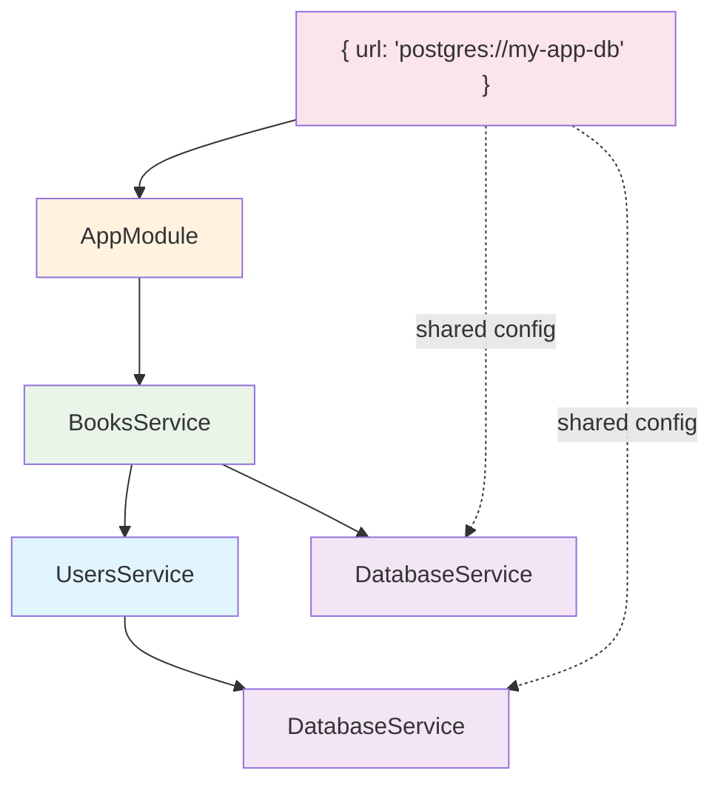
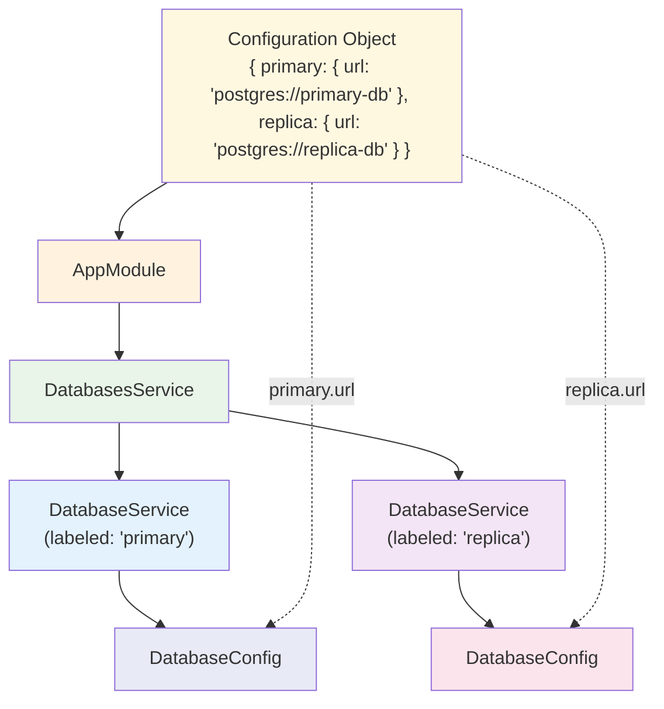

# nestjs-smart-modules

[](https://badge.fury.io/js/nestjs-smart-modules)
[](https://opensource.org/licenses/MIT)
[](https://www.typescriptlang.org/)
[](https://nestjs.com/)
[](https://www.npmjs.com/package/nestjs-smart-modules)

**Transform NestJS modules into composable, type-safe building blocks.** Configure once, compose everywhere.

## Key Features

- **One-Line Integration** - Works with existing NestJS code
- **100% Type-Safe** - Full TypeScript support with autocompletion
- **True Composition** - Modules automatically include dependencies
- **Zero Boilerplate** - Service class becomes the module
- **Flexible Architecture** - Single or multiple instances with namespacing
- **Tree-Shakeable** - Bundle only what you use

## Quick Start

Transform any service into a smart module in seconds:

```typescript
import { Injectable, Module } from '@nestjs/common'
import { smartModule } from 'nestjs-smart-modules'

// 1. Define your configuration
export class DatabaseConfig {
  url: string
  poolSize?: number = 10
}

// 2. Create your service with embedded module definition
@Injectable()
export class DatabaseService {
  static smartModule = smartModule({
    smartConfigs: [DatabaseConfig],
    providers: [DatabaseService],
    exports: [DatabaseService],
  })

  constructor(private config: DatabaseConfig) {}

  query(sql: string) {
    return `Executing: ${sql} on ${this.config.url}`
  }
}

// 3. Create a feature service that depends on DatabaseService
@Injectable()
export class FeatureService {
  static smartModule = smartModule({
    smartImports: [DatabaseService.smartModule],
    providers: [FeatureService],
    exports: [FeatureService],
  })

  constructor(private db: DatabaseService) {}

  getUsers() {
    return this.db.query('SELECT * FROM users')
  }
}

// 4. Use it anywhere with full type safety - configuration flows down automatically
@Module({
  imports: [
    FeatureService.smartModule({
      url: 'postgres://localhost:5432/mydb',
    }),
  ],
})
export class AppModule {}
```

✅ **Test easily** - Provide only what each module needs at any level

## How It Works

Smart modules automatically build your dependency tree and merge configuration requirements:

```typescript
// Your dependency tree
AppModule
  └── FeatureService.smartModule({ url: "..." }) // Pass config at the top level
       └── DatabaseService.smartModule           // Gets config automatically!
            └── DatabaseConfig                   // Configured once at the root
```

This works in three steps:

1. **Dependency Discovery** - The library walks your entire dependency tree
2. **Configuration Merging** - It collects all config requirements into one object
3. **Smart Distribution** - It delivers the right config to each module automatically

---

## Table of Contents

- [Installation](#installation)
- [Basic Usage](#basic-usage)
  - [Creating a Module with a Configuration Class](#creating-a-module-with-a-configuration-class)
- [Configuration](#configuration)
  - [Namespacing with Labels and Prefixes](#namespacing-with-labels-and-prefixes)
  - [Labels: Grouping Under Nested Objects](#labels-grouping-under-nested-objects)
  - [Prefixes: Flattened Property Naming](#prefixes-flattened-property-naming)
- [Module Composition](#module-composition)
  - [Importing Other Smart Modules](#importing-other-smart-modules)
  - [Advanced: Namespacing Composed Modules](#advanced-namespacing-composed-modules)
- [Advanced Usage](#advanced-usage)
  - [Using Injection Tokens](#using-injection-tokens)
  - [Asynchronous Configuration](#asynchronous-configuration)
  - [Module Definition Factory](#module-definition-factory)
- [Recipes](#recipes)
  - [Multiple Instances of a Module](#creating-and-using-multiple-instances-of-a-module)
  - [Global Configuration Module](#creating-a-global-configuration-module-the-forroot-pattern)
- [API Reference](#api-reference)

## Installation

```bash
npm install nestjs-smart-modules
```

## Basic Usage

### Creating a Module with a Configuration Class

This is the most common use case. You provide a configuration class via `smartConfigs`, and `smartModule` handles the configuration and dependency injection.

**Config Class:**

```typescript
// auth.config.ts
export class AuthConfig {
  // A required property must be provided when configuring the module.
  jwtSecret: string

  // An optional property can be omitted. It will be `undefined` if not provided.
  audience?: string

  // A property with a default value.
  // For this to be truly optional at the configuration stage,
  // it MUST be marked with a `?`.
  expiresIn?: string = '60s'
}
```

> **Important:** Always mark properties with default values as optional with a `?` (e.g., `myProp?: string = 'default'`). Without the `?`, TypeScript will require you to provide a value for that property when you configure the module, even though it has a default.

**Smart Module and Service:**

```typescript
// auth.service.ts
import { Injectable } from '@nestjs/common'
import { smartModule } from 'nestjs-smart-modules'
import { AuthConfig } from './auth.config'

@Injectable()
export class AuthService {
  static smartModule = smartModule({
    smartConfigs: [AuthConfig], // Use the `smartConfigs` property here
    providers: [AuthService],
    exports: [AuthService],
  })

  constructor(private readonly config: AuthConfig) {
    // You can access the fully instantiated config here
  }
}
```

**Usage:**

```typescript
// app.module.ts
import { Module } from '@nestjs/common'
import { AuthService } from './auth.service'

@Module({
  imports: [
    AuthService.smartModule({
      jwtSecret: 'your-super-secret-key',
      // `audience` is omitted
      // `expiresIn` is omitted, so it will use the default '60s'
    }),
  ],
})
export class AppModule {}
```

<details>
<summary><strong>Pattern: The "One Class, One Module"</strong></summary>

The example above illustrates a key design pattern encouraged by this library: **treating the service class as the module itself.**

By defining a static `smartModule` property on `LoggerService`, we have effectively merged the service and its module definition into a single class. This is the recommended pattern and provides several advantages over traditional NestJS module organization:

- **Zero Boilerplate:** You no longer need separate `my-service.module.ts` files. The service class is self-contained and provides its own module definition, which significantly reduces the number of files and boilerplate code in your application.
- **Improved Encapsulation:** All logic related to the service—its implementation, its providers, and its exports—is co-located in a single file. This makes the service a true, self-contained building block.
- **Intuitive Structure:** Your application becomes a collection of services rather than a collection of modules. When you need to use `LoggerService`, you import `LoggerService.smartModule()`, which is more direct and intuitive than importing a separate `LoggerModule`. This flattens the mental model of your application, making it easier to navigate and reason about.

This pattern is the foundation for the composability and simplicity that `nestjs-smart-modules` aims to provide.

</details>

<details>
<summary><strong>Automatic Module Naming</strong></summary>

When you define `smartModule` as a `static` property on a class (e.g., `MyService`), the library automatically generates a descriptive name for the underlying `DynamicModule`, such as `MyServiceSmartModule`. This is extremely useful for debugging, as it makes dependency graphs much easier to read in NestJS error logs or graphical representations.

Similarly, when you use configuration classes with `smartConfigs`, the library automatically creates named modules for them as well. For example, if you have an `AuthConfig` class, the library will generate a module named `AuthConfigSmartConfigModule` that handles the configuration instantiation and dependency injection. This automatic naming applies to all configuration classes, making it easy to trace configuration-related issues in your application.

To ensure this feature works correctly, always define your smart modules on a named class and use named configuration classes.

</details>

## Configuration

### Namespacing with Labels and Prefixes

Both labels and prefixes solve the same problem: **avoiding configuration property conflicts**. When composing multiple modules or using multiple instances of the same module, you need ways to separate their configurations.

> **Important:** When defining a `label` or `prefix` inline, always use `as const`. This tells TypeScript to treat it as a literal type, which is essential for correct type inference.
>
> **Note on `smartImports`:** Applying a `label` or `prefix` to a `smartImport` only affects how configuration is passed down to it. It does **not** change the providers or injection tokens within the imported module itself.

### Labels: Grouping Under Nested Objects

Labels create a nested object structure in your configuration. This is useful for logically grouping related settings or avoiding property name conflicts.

**Example: Using Labels**

```typescript
// Two configs with a conflicting 'port' property.
export class DatabaseConfig {
  port: number
}
export class CacheConfig {
  port: number
}

export class AppService {
  static smartModule = smartModule({
    smartConfigs: [
      { smartConfig: DatabaseConfig, label: 'db' as const },
      { smartConfig: CacheConfig, label: 'cache' as const },
    ],
  })
}

@Module({
  imports: [
    AppService.smartModule({
      db: { port: 5432 },
      cache: { port: 6379 },
    }),
  ],
})
export class AppModule {}
```

You can also define a default label directly on the configuration class using a `static` property. It will be used automatically unless overridden.

**Example: Static Labels**

```typescript
// Two configs with a conflicting 'port' property and static labels.
export class EmailConfig {
  static label = 'email' as const
  port: number
}
export class SmsConfig {
  static label = 'sms' as const
  port: number
}

export class NotificationsService {
  static smartModule = smartModule({
    // The static `label` on each class is used automatically.
    smartConfigs: [EmailConfig, SmsConfig],
  })
}

@Module({
  imports: [
    NotificationsService.smartModule({
      email: { port: 587 },
      sms: { port: 443 },
    }),
  ],
})
export class AppModule {}
```

> **Note:** A static `label` on a config class will be overridden if you provide a `label` property inline where the class is used.

### Prefixes: Flattened Property Naming

Prefixes add a prefix to each property name, creating a flat configuration structure. This is useful for avoiding property name conflicts while keeping all settings at the same level.

**Example: Using Prefixes**

```typescript
// Two configs with a conflicting 'port' property.
export class DatabaseConfig {
  port: number
}
export class CacheConfig {
  port: number
}

export class AppService {
  static smartModule = smartModule({
    smartConfigs: [
      { smartConfig: DatabaseConfig, prefix: 'db_' as const },
      { smartConfig: CacheConfig, prefix: 'cache_' as const },
    ],
  })
}

@Module({
  imports: [
    AppService.smartModule({
      db_port: 5432,
      cache_port: 6379,
    }),
  ],
})
export class AppModule {}
```

A `static prefix` can also be defined directly on the configuration class.

**Example: Static Prefixes**

```typescript
// Two configs with a conflicting 'port' property and static prefixes.
export class EmailConfig {
  static prefix = 'email_' as const
  port: number
}
export class SmsConfig {
  static prefix = 'sms_' as const
  port: number
}

export class NotificationsService {
  static smartModule = smartModule({
    // The static `prefix` on each class is used automatically.
    smartConfigs: [EmailConfig, SmsConfig],
  })
}

@Module({
  imports: [
    NotificationsService.smartModule({
      email_port: 587,
      sms_port: 443,
    }),
  ],
})
export class AppModule {}
```

> **Note:** A static `prefix` on a config class will be overridden if you provide a `prefix` property inline where the class is used.

## Module Composition

Module composition enables building applications as dependency trees. Each service defines its `smartModule` with dependencies, and the library merges all configuration requirements into a single root object.

<details>
<summary><strong>How Module Composition Works</strong></summary>

For instance, your `AppModule` might import a `BooksService`, which in turn depends on a `DatabaseService`. Even if other services also depend on `DatabaseService`, its configuration is required only once at the application's root.

The library automates the entire process:

1.  It walks the full dependency tree.
2.  It gathers configuration requirements from every module.
3.  It creates a single, unified configuration object for you to provide at the top level.
4.  It intelligently delivers the right piece of configuration to each module, no matter how deep it is in the tree.

This approach provides powerful benefits:

- **Simplified Architecture:** Services become self-contained, reusable "black box" components that only know about their direct dependencies. This high level of **composability** and **encapsulation** makes it easy to move services or extract them into libraries without breaking changes.
- **Centralized Configuration:** You configure the entire application from a single object at the root. This **single point of configuration** eliminates the need to pass configuration down through multiple layers, making your app easier to manage and reason about.
- **Complete Type Safety:** The entire configuration tree is **fully type-safe**. You get autocompletion for all available options and compile-time checks, preventing common runtime errors.

Ultimately, this shifts the paradigm from managing loosely-coupled modules to building a well-defined, composable tree of services.

</details>

<details>
<summary><strong>Pattern: Naming Conventions for `smartModule` vs `forRoot`</strong></summary>
Use `smartModule` for composable services that depend on other services. Use `forRoot` for top-level feature modules that are imported directly into your `AppModule`.

To align with NestJS conventions and enhance clarity, this library promotes a specific naming pattern for its static factory methods. The choice between `smartModule` and `forRoot` clarifies a module's role in your application architecture.

**`static smartModule = smartModule(...)`: For Composable Service Blocks**

This pattern is for creating **reusable, injectable services** that act as building blocks for larger features. Use `smartModule` when creating a service intended to be a **dependency for other smart modules**. It should encapsulate a distinct piece of business logic meant for composition.

Think of these as the internal components that form your application's dependency tree.

```typescript
// users.service.ts
export class UsersService {
  static smartModule = smartModule({
    // It IMPORTS another service's smartModule
    smartImports: [DatabaseService.smartModule],
    providers: [UsersService],
    exports: [UsersService],
  })
  // ...
}
```

**`static forRoot = smartModule(...)`: For Top-Level Feature Modules**

This pattern is for **top-level modules** that configure application-wide features and are typically imported only once, directly into your `AppModule`. Use `forRoot` when a module's primary purpose is not to provide a composable service, but to:

- Provide global configuration (e.g., `GlobalConfigModule`).
- Register controllers for a specific feature (e.g., `UsersModule`).

These are "leaf" nodes in your dependency tree, consumed by the application root rather than other services.

```typescript
// app.module.ts
@Module({
  imports: [
    // AppModule IMPORTS a feature module using .forRoot()
    UsersModule.forRoot({ ... }),
    GlobalConfigModule.forRoot({ ... }),
  ],
})
export class AppModule {}
```

**Summary:** Use `smartModule` for services that are dependencies **of other services**. Use `forRoot` for feature modules that are dependencies **of the application itself**. This cleanly separates reusable logic from top-level application structure.

</details>

### Importing Other Smart Modules

Use `smartImports` to compose services. When one smart module imports another, the library merges configuration requirements. You only need to provide configuration for "leaf" nodes at the application's top level.

**Example: A Multi-Level Dependency Tree**

This example demonstrates a dependency tree:



```typescript
// 1. The deepest dependency, requiring a `url` for its configuration.
export class DatabaseConfig {
  url: string
}

@Injectable()
export class DatabaseService {
  static smartModule = smartModule({
    smartConfigs: [DatabaseConfig],
    providers: [DatabaseService],
    exports: [DatabaseService],
  })
  constructor(private readonly config: DatabaseConfig) {}
}

// 2. A service that depends on DatabaseService.
@Injectable()
export class UsersService {
  static smartModule = smartModule({
    smartImports: [DatabaseService.smartModule],
    providers: [UsersService],
    exports: [UsersService],
  })
  constructor(private readonly dbService: DatabaseService) {}
}

// 3. A top-level service that depends on both.
@Injectable()
export class BooksService {
  static smartModule = smartModule({
    smartImports: [UsersService.smartModule, DatabaseService.smartModule],
    providers: [BooksService],
    exports: [BooksService],
  })
  constructor(
    private readonly usersService: UsersService,
    private readonly dbService: DatabaseService,
  ) {}
}

// 4. The root module.
@Module({
  // By importing BooksService, we also implicitly import its dependencies.
  // The library gathers all configuration requirements, so we only need to
  // provide the `url` for the deeply nested DatabaseService here.
  imports: [BooksService.smartModule({ url: 'postgres://my-app-db' })],
})
export class AppModule {}
```

In this example, `AppModule` only configures `BooksService`. The library automatically merges the requirements from `BooksService` and `UsersService`, recognizes that both need `DatabaseService` with a `url`, and passes the single `url` to both instances. This prevents configuration duplication and simplifies dependency management.

### Advanced: Namespacing Composed Modules

You can apply a `label` or `prefix` to an entire `smartImport` to namespace the complete configuration tree. This is useful when integrating complex third-party smart modules to avoid configuration key collisions.

**Example:**

```typescript
// 1. Define the dependency services and their configs.
export class LoggerConfig {
  log_level: string
}
@Injectable()
export class LoggerService {
  static smartModule = smartModule({
    smartConfigs: [LoggerConfig],
    providers: [LoggerService],
    exports: [LoggerService],
  })
  constructor(private readonly config: LoggerConfig) {}
}

export class MetricsConfig {
  metrics_url: string
}
@Injectable()
export class MetricsService {
  static smartModule = smartModule({
    smartConfigs: [MetricsConfig],
    providers: [MetricsService],
    exports: [MetricsService],
  })
  constructor(private readonly config: MetricsConfig) {}
}

// 2. This third-party service bundles its own dependencies.
@Injectable()
export class ThirdPartyAnalyticsService {
  static smartModule = smartModule({
    smartImports: [LoggerService.smartModule, MetricsService.smartModule],
    providers: [ThirdPartyAnalyticsService],
    exports: [ThirdPartyAnalyticsService],
  })
  constructor(
    private readonly logger: LoggerService,
    private readonly metrics: MetricsService,
  ) {}
}

// 3. To avoid potential configuration conflicts, we wrap its import with a label.
@Injectable()
export class AppService {
  static smartModule = smartModule({
    smartImports: [
      {
        smartImport: ThirdPartyAnalyticsService.smartModule,
        label: 'analytics' as const,
      },
    ],
    providers: [AppService],
    exports: [AppService],
  })
  constructor(private readonly analyticsService: ThirdPartyAnalyticsService) {}
}

@Module({
  imports: [
    // Now, the entire configuration for the third-party module and all of its
    // dependencies is nested under the 'analytics' key.
    AppService.smartModule({
      analytics: {
        log_level: 'debug',
        metrics_url: 'http://metrics.service.com',
      },
    }),
  ],
})
export class AppModule {}
```

## Advanced Usage

### Using Injection Tokens

Configuration uses its class as the injection token by default. You can override this with custom string or symbol tokens to avoid class-based injection or conflicts.

> **Note:** The `token` option is only available for `smartConfigs`, not for `smartImports`.

**Example: Inline Token**

```typescript
// redis.service.ts
import { Inject, Injectable } from '@nestjs/common'
import { smartModule } from 'nestjs-smart-modules'

export class RedisConfig {
  host: string
  port: number
}
export const REDIS_CONFIG_TOKEN = 'REDIS_CONFIG'

@Injectable()
export class RedisService {
  static smartModule = smartModule({
    smartConfigs: [{ smartConfig: RedisConfig, token: REDIS_CONFIG_TOKEN }],
    providers: [RedisService],
    exports: [RedisService],
  })

  constructor(@Inject(REDIS_CONFIG_TOKEN) private readonly config: RedisConfig) {}
}
```

**Example: Static Token on Config Class**

```typescript
// notifications.config.ts
export class NotificationsConfig {
  static token = 'NOTIFICATIONS_CONFIG' // Static token
  apiKey: string
}

// notifications.service.ts
import { Inject, Injectable } from '@nestjs/common'
import { smartModule } from 'nestjs-smart-modules'
import { NotificationsConfig } from './notifications.config.ts'

@Injectable()
export class NotificationsService {
  static smartModule = smartModule({
    smartConfigs: [NotificationsConfig],
    providers: [NotificationsService],
    exports: [NotificationsService],
  })

  constructor(@Inject(NotificationsConfig.token) private readonly config: NotificationsConfig) {}
}
```

> **Note:** A static `token` on a config class will be overridden if you provide a `token` property inline where the class is used.

### Asynchronous Configuration

**Recommendation:** Use synchronous configuration whenever possible. Only use async configuration for exceptional cases when config must be loaded from a running NestJS provider.

<details>
<summary><strong>Synchronous vs. Asynchronous Configuration Details</strong></summary>

While asynchronous configuration is fully supported, the **recommended best practice is a synchronous setup.** The ideal approach is to gather all configuration (e.g., from environment variables or a config service) _before_ the NestJS application starts. This allows you to bootstrap the entire application with a single, complete configuration object, leading to a more predictable and robust startup process.

Asynchronous configuration should only be used for exceptional cases, such as when a piece of configuration is only available from a provider within a running NestJS application.

</details>

For exceptional cases where synchronous setup isn't possible, `smartModule` can handle asynchronous configuration. This is useful when integrating with legacy modules or when configuration comes from running NestJS providers.

**Example:**

Imagine you have a `ConfigModule` that asynchronously provides a `ConfigService`.

```typescript
// auth.service.ts
import { Injectable } from '@nestjs/common'
import { smartModule } from 'nestjs-smart-modules'

export class AuthConfig {
  jwtSecret: string
  expiresIn: string
}

@Injectable()
export class AuthService {
  static smartModule = smartModule({
    smartConfigs: [AuthConfig],
    providers: [AuthService],
    exports: [AuthService],
  })

  constructor(private readonly config: AuthConfig) {}
}

// app.module.ts
import { Module } from '@nestjs/common'
import { ConfigModule, ConfigService } from '@nestjs/config'
import { AuthService } from './auth.service'

@Module({
  imports: [
    ConfigModule.forRoot(), // Standard NestJS ConfigModule
    AuthService.smartModule({
      imports: [ConfigModule],
      inject: [ConfigService],
      useFactory: (configService: ConfigService) => ({
        jwtSecret: configService.get('JWT_SECRET'),
        expiresIn: configService.get('JWT_EXPIRES_IN'),
      }),
    }),
  ],
})
export class AppModule {}
```

### Module Definition Factory

The factory pattern provides an "escape hatch" when module definitions depend on resolved configuration values. Use this only when static module definitions aren't sufficient.

Common use cases include:

- **Dynamic Provider Values:** Creating a provider whose `useValue` is derived from one or more configuration properties.
- **Conditional Providers:** Conditionally registering a provider based on a flag in the configuration (e.g., enabling a `MockService` for testing).
- **Wrapping Third-Party Modules:** Dynamically importing and configuring a third-party module (e.g., `@nestjs/jwt`) using values from your smart configuration.
- **Dynamic Imports:** Conditionally importing other modules based on the configuration.
- **Re-exporting Dependencies:** Gaining access to the dynamically created configuration modules to re-export them, making them available to other modules that import your smart module.

> While you can pass configurations as inline arguments, the recommended pattern is to use the `smartConfigs` and `smartImports` properties inside the module definition object for better clarity. **The primary use case for passing configs as inline arguments is to use them with this factory pattern.**

**Signature:**

```typescript
smartModule(
  ...configs: AnySmartConfig[], // Passed inline for factory access
  factory: (imports: DynamicModule[], ...instantiatedConfigs: object[]) => SmartModule
)
```

### Use Case: Dynamic Provider Values

The most common reason to use the factory pattern is to create providers whose definitions depend on the values from your configuration. Because the factory function only runs _after_ the `DatabaseConfig` has been instantiated, you can access its properties.

> **Note:** For this pattern to work, configuration classes **must** be passed as inline arguments to `smartModule`, not inside the `smartConfigs` property. This is only available during **synchronous** module creation.

**Example:**

```typescript
import { Inject, Injectable } from '@nestjs/common'
import { smartModule } from 'nestjs-smart-modules'

export class ReportingConfig {
  apiUrl: string
}

@Injectable()
export class ReportingService {
  static smartModule = smartModule(
    ReportingConfig, // Passed inline to be available in the factory
    (imports, reportingConfig: ReportingConfig) => ({
      imports,
      providers: [
        ReportingService,
        {
          provide: 'REPORTING_SERVICE_URL',
          // Use the config value at definition time
          useValue: `${reportingConfig.apiUrl}/reports`,
        },
      ],
      exports: [ReportingService],
    }),
  )

  constructor(@Inject('REPORTING_SERVICE_URL') private readonly reportingUrl: string) {}
}

@Module({
  imports: [
    ReportingService.smartModule({
      apiUrl: 'http://api.service.com',
    }),
  ],
})
export class AppModule {}
```

### Use Case: Wrapping a Third-Party Module

The factory pattern is especially powerful when you need to wrap a traditional NestJS module that uses a standard `.forRoot()` or `.register()` configuration pattern. This allows you to integrate third-party modules into your `smartModule` ecosystem seamlessly.

By using the factory, you can instantiate your configuration class first and then pass its values to the third-party module's configuration method.

**Example: Wrapping `JwtModule`**

```typescript
import { Injectable } from '@nestjs/common'
import { smartModule } from 'nestjs-smart-modules'
import { JwtModule } from '@nestjs/jwt'

// 1. Define the configuration for the third-party module.
export class JwtConfig {
  secret: string
  signOptions: { expiresIn: string }
}

// 2. Create a wrapper service.
@Injectable()
export class JwtWrapperService {
  static smartModule = smartModule(
    JwtConfig, // Pass config inline to access it in the factory.
    (imports, jwtConfig: JwtConfig) => {
      // 3. Dynamically register the third-party module using the config.
      const jwtModule = JwtModule.register({
        secret: jwtConfig.secret,
        signOptions: jwtConfig.signOptions,
      })

      return {
        imports: [...imports, jwtModule],
        providers: [JwtWrapperService],
        // 4. Export both your service and the third-party module.
        exports: [JwtWrapperService, jwtModule],
      }
    },
  )
}

// 5. Use the wrapper service in your application.
@Module({
  imports: [
    JwtWrapperService.smartModule({
      secret: 'your-secret-key',
      signOptions: { expiresIn: '60s' },
    }),
  ],
})
export class AppModule {}
```

This pattern allows any other service that imports `JwtWrapperService.smartModule` to inject NestJS's `JwtService` directly, without needing to know about the underlying configuration details.

### Use Case: Re-exporting Dependencies

The first argument to the factory function, `imports`, is an array of `DynamicModule` instances. These modules are automatically generated by `smartModule` for each inline `SmartConfig` class that you provided.

Each of these dynamic modules is responsible for providing one of your configured dependencies. For example, if you pass `DatabaseConfig` as an inline smart config, one of the modules in the `imports` array will be the one that provides the configured instance of `DatabaseConfig`.

While `smartModule` automatically adds this `imports` array to the `imports` array of the final module it creates, you might want to access it for advanced use cases, such as re-exporting the modules.

**Example:**

```typescript
import { Injectable } from '@nestjs/common'
import { smartModule } from 'nestjs-smart-modules'

export class DatabaseConfig {
  url: string
}
export class CacheConfig {
  host: string
}

@Injectable()
export class MyService {
  static smartModule = smartModule(
    DatabaseConfig, // Pass SmartConfig classes inline
    CacheConfig,
    imports => ({
      providers: [MyService],
      // You can now access the created modules for DatabaseConfig and CacheConfig
      // and re-export them.
      exports: [MyService, ...imports],
    }),
  )
}

@Module({
  imports: [
    MyService.smartModule({
      url: 'postgres://localhost:5432',
      host: 'redis://localhost:6379',
    }),
  ],
})
export class AppModule {}
```

## Recipes

This section covers advanced patterns and solutions to common problems.

### Creating and Using Multiple Instances of a Module

**The Challenge:** NestJS dependency injection is designed around singletons. If you import the same module in multiple places, you get the same provider instance. This makes it difficult to create separate instances (e.g., primary and replica databases).

**The Solution: A Labeled Module Factory**

Create a static factory function on your service class that generates uniquely-provided, labeled modules. This encapsulates the complexity and provides a clean API using `smartImports` and `smartConfigs`.

**Step 1: Enhance the Base Service**

Add three static helper methods to your `DatabaseService` class:

1.  `getTokenForLabel(label: string)`: A public method that creates a predictable, unique injection token.
2.  `Inject(label: string)`: A decorator that simplifies injecting the service with a specific label.
3.  `smartModuleCustom(label: string)`: A factory that returns a `smartModule` that provides the `DatabaseService` under a unique token.

```typescript
// database.service.ts
import { Inject, Injectable } from '@nestjs/common'
import { smartModule } from 'nestjs-smart-modules'

export class DatabaseConfig {
  url: string
}

@Injectable()
export class DatabaseService {
  // The base smartModule for a single, default instance.
  static smartModule = smartModule({
    smartConfigs: [DatabaseConfig],
    providers: [DatabaseService],
    exports: [DatabaseService],
  })

  static getTokenForLabel(label: string) {
    return `${label.toUpperCase()}_DATABASE_SERVICE`
  }

  static Inject = (label: string) => Inject(DatabaseService.getTokenForLabel(label))

  static smartModuleCustom = function (label: string) {
    const token = this.getTokenForLabel(label)

    return smartModule({
      smartConfigs: [DatabaseConfig],
      providers: [
        DatabaseService, // Provide the base service...
        {
          provide: token,
          useClass: DatabaseService, // ...and create a new instance for the unique token.
        },
      ],
      exports: [token],
    })
  }

  constructor(private readonly config: DatabaseConfig) {}

  find(query: string) {
    return `${this.config.url} for ${query}`
  }
}
```

**Step 2: Create a Higher-Level Service**

Create a higher-level service that consumes the uniquely provided database instances and encapsulates its own dependencies with its own `smartModule`.



```typescript
// databases.service.ts
import { Injectable } from '@nestjs/common'
import { DatabaseService } from './database.service'
import { smartModule } from 'nestjs-smart-modules'

@Injectable()
export class DatabasesService {
  // This service becomes a self-contained smart module.
  static smartModule = smartModule({
    // It declares its dependencies on the labeled database modules.
    smartImports: [
      {
        smartImport: DatabaseService.smartModuleCustom('primary'),
        label: 'primary' as const,
      },
      {
        smartImport: DatabaseService.smartModuleCustom('replica'),
        label: 'replica' as const,
      },
    ],
    providers: [DatabasesService],
    exports: [DatabasesService],
  })

  constructor(
    @DatabaseService.Inject('primary')
    private readonly primaryDb: DatabaseService,
    @DatabaseService.Inject('replica')
    private readonly replicaDb: DatabaseService,
  ) {}

  // Example method that uses both database connections.
  find(query: string) {
    return [this.primaryDb.find(query), this.replicaDb.find(query)]
  }
}
```

**Step 3: Compose the Application**

The final application composition becomes simple. Just import `DatabasesService.smartModule` and provide the expected configuration object.

```typescript
// app.module.ts
import { Module } from '@nestjs/common'
import { DatabasesService } from './databases.service'

@Module({
  imports: [
    // Import the top-level service and provide the combined config.
    DatabasesService.smartModule({
      primary: {
        url: 'postgres://primary-db',
      },
      replica: {
        url: 'postgres://replica-db',
      },
    }),
  ],
})
export class AppModule {}
```

### Creating a Global Configuration Module (the `forRoot` pattern)

> **When to use this pattern:** While this pattern is powerful, it's important to understand its place. If you are building an entire application from the ground up with `nestjs-smart-modules`, you typically **do not need** a `.forRoot()` module. The recommended approach is to build a dependency tree and provide a single configuration object to your root `AppModule`, as described in the [Module Composition](#3-module-composition) section.
>
> This `forRoot` pattern is most useful in two scenarios:
>
> 1.  **Incremental Adoption:** When you want to introduce `nestjs-smart-modules` into an existing, traditional NestJS application.
> 2.  **Creating Standalone Libraries:** If you are building a reusable library for others to consume, providing a familiar `.forRoot()` method for configuration is a common and well-understood convention.

A common requirement is having a single, globally available configuration that any service can access without importing specific modules everywhere. Traditional NestJS uses `.forRoot()` static methods. You can achieve the same result cleanly with `smartModule`.

**Step 1: Define the Global Configuration and Module**

Create `GlobalConfig` class and `GlobalConfigModule` that provides it globally. Use the factory pattern with `smartModule` to re-export the configuration module.

```typescript
// global-config.module.ts
import { Injectable } from '@nestjs/common'
import { smartModule } from 'nestjs-smart-modules'

// Define the shape of your global configuration.
export class GlobalConfig {
  appName: string
  isProduction: boolean
}

// Create a self-contained module for the config.
@Injectable()
export class GlobalConfigModule {
  // Use smartModule to create a configurable, global module.
  static forRoot = smartModule(GlobalConfig, imports => ({
    global: true, // This makes the providers available everywhere.
    exports: imports,
    // exports: [GlobalConfig], // will not work because smart config not injected into a smart module but into a new module that goes into imports array, we cant export others module exports only re export whole imported module
  }))
}
```

**Step 2: Inject the Global Config in a Feature Service**

Any service can now inject `GlobalConfig` directly. This service demonstrates using configuration in business logic.

```typescript
// feature.service.ts
import { Injectable } from '@nestjs/common'
import { GlobalConfig } from './global-config.module'

@Injectable()
export class FeatureService {
  constructor(private readonly config: GlobalConfig) {}

  doSomething() {
    if (!this.config.isProduction) {
      return 'not production'
    }

    return 'production'
  }
}
```

**Step 3: Provide the Configuration in AppModule**

Create `AppModule` using `smartModule` that imports global configuration. Demonstrates synchronous configuration pattern.

```typescript
// app.module.ts
import { smartModule } from 'nestjs-smart-modules'
import { GlobalConfigModule } from './global-config.module'
import { FeatureService } from './feature.service'

export class AppModule {
  static smartModule = smartModule({
    imports: [
      GlobalConfigModule.forRoot({
        appName: 'My Awesome App',
        isProduction: true,
      }),
    ],
    providers: [FeatureService],
  })
}
```

This pattern provides clean, type-safe global configuration management using the factory pattern with `smartModule`. The global flag makes configuration available throughout the application.

**Asynchronous Configuration**

The factory pattern supports asynchronous configuration using standard `useFactory` pattern. This example integrates with NestJS's `ConfigModule` for environment-based configuration.

**Example:**

```typescript
// async-app.module.ts
import { ConfigModule, ConfigService } from '@nestjs/config'
import { smartModule } from 'nestjs-smart-modules'
import { GlobalConfigModule } from './global-config.module'
import { FeatureService } from './feature.service'

export class AsyncAppModule {
  static smartModule = smartModule({
    imports: [
      ConfigModule.forRoot({ isGlobal: true }), // Make the standard ConfigService available
      GlobalConfigModule.forRoot({
        imports: [ConfigModule],
        inject: [ConfigService],
        useFactory: (configService: ConfigService) => ({
          appName: configService.get('APP_NAME') || 'My Async App',
          isProduction: configService.get('NODE_ENV') === 'production',
        }),
      }),
    ],
    providers: [FeatureService],
  })
}
```

## API Reference

### `smartModule()` Function

The core function that transforms your service into a configurable module factory.

**Signature:**

```typescript
smartModule(definition: SmartModuleDefinition): (config: object) => DynamicModule
```

**Parameters:**

- `definition` - Object containing module definition and smart configurations

**SmartModuleDefinition Interface:**

```typescript
interface SmartModuleDefinition {
  // Standard NestJS DynamicModule properties
  module?: any // Default: the service class itself
  imports?: any[]
  controllers?: any[]
  providers?: any[]
  exports?: any[]
  global?: boolean

  // Smart module specific properties
  smartConfigs?: SmartConfig[] // Configuration classes
  smartImports?: SmartImport[] // Other smart modules to import
}
```

**SmartConfig Options:**

```typescript
type SmartConfig =
  | ConfigClass // Simple config class
  | {
      // Advanced config options
      smartConfig: ConfigClass
      label?: string // Namespace under nested object
      prefix?: string // Prefix all properties
      token?: string | symbol // Custom injection token
    }
```

**SmartImport Options:**

```typescript
type SmartImport =
  | SmartModuleFactory // Simple import
  | {
      // Advanced import options
      smartImport: SmartModuleFactory
      label?: string // Namespace configuration
      prefix?: string // Prefix configuration
    }
```

### Configuration Class Requirements

Configuration classes should follow these patterns:

```typescript
export class MyConfig {
  // Required properties
  requiredProp: string

  // Optional properties
  optionalProp?: string

  // Properties with defaults (must be optional!)
  defaultProp?: number = 42

  // Static configuration
  static label?: string = 'myConfig'
  static prefix?: string = 'my_'
  static token?: string = 'MY_CONFIG_TOKEN'
}
```

### Factory Pattern

For advanced use cases where module definition depends on configuration values:

```typescript
smartModule(
  ...configs: ConfigClass[],
  factory: (imports: DynamicModule[], ...configs: object[]) => SmartModuleDefinition
): (config: object) => DynamicModule
```

### Asynchronous Configuration

For cases requiring async configuration:

```typescript
MyService.smartModule({
  imports: [ConfigModule],
  inject: [ConfigService],
  useFactory: (configService: ConfigService) => ({
    // Return your configuration object
  }),
})
```
